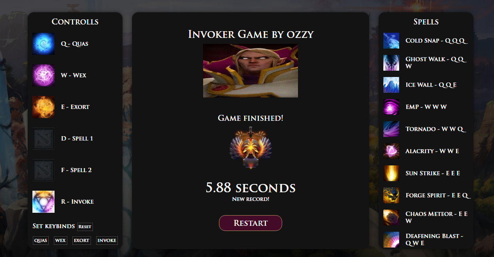

# Invoker-Game-AutoCast

This script automates spell invocation for the hero Invoker from the game Dota 2 on the website **[example.com](https://invoker-game.com/)**. It detects the currently selected spell and performs the corresponding combination of orb key presses (`Q`, `W`, `E`) followed by the `R` key to invoke the spell.

## Features

- **Automatic Spell Casting:** Detects the selected spell and triggers the correct combination of keys.
- **Supports All Invoker Spells:**
  - Cold Snap
  - Ghost Walk
  - Ice Wall
  - EMP
  - Tornado
  - Alacrity
  - Sun Strike
  - Forge Spirit
  - Chaos Meteor
  - Deafening Blast
- **Configurable Delays:** Uses promises to manage delays between key presses for accurate input.

## How It Works

1. The script listens for the `X` key (`keyCode: 88`).
2. When triggered, it checks the currently selected spell by reading the `p` element inside the `.curent__spell` container.
3. If the spell matches one in the predefined list, it executes the sequence of orb key presses (`Q`, `W`, `E`) and the invoke key (`R`).
   
## Installation
Copy the script into a JavaScript file or paste it into the browser console.

- **Result:** 
  
## Prerequisites

- This script is designed to work on the website **[example.com](https://invoker-game.com/)**. Ensure the following structure exists on the page:
  ```html
  <div class="curent__spell">
      <p>Spell Name</p>
  </div>
